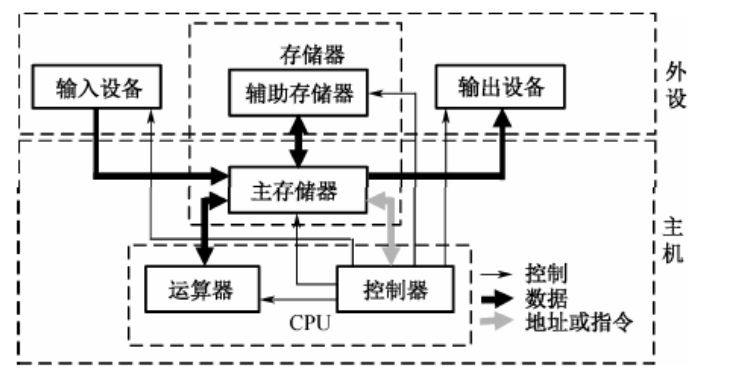

# 系统架构考试

## 一.计算机组成与体系结构
### 1.1 计算机系统组成
#### 1.1.1 计算机硬件的组成

硬件通常是指一切看得见，摸得到的设备实体。原始的冯•诺依曼（VonNeumann）计
算机在结构上是以运算器为中心的，而发展到现在，已转向以存储器为中心了。

(1).控制器
控制器是分析和执行指令的部件，也是统一指挥并控制计算机各部件协
调工作的中心部件，所依据的是机器指令。